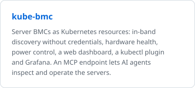
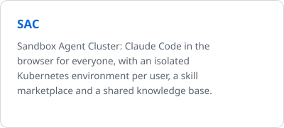
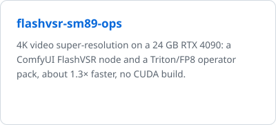
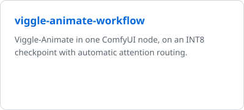
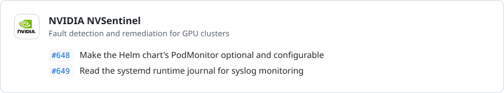
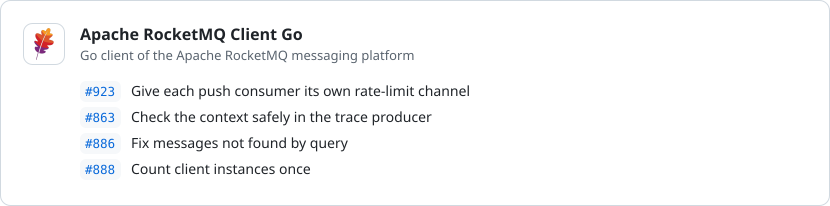

# Xuexue (aireet)

## About Me
人菜瘾大

## Projects

<a href="https://github.com/aireet/kube-bmc"><picture><source media="(prefers-color-scheme: dark)" srcset="profile/project-kube-bmc-dark.svg"></picture></a>
<a href="https://github.com/aireet/sac"><picture><source media="(prefers-color-scheme: dark)" srcset="profile/project-sac-dark.svg"></picture></a>

<a href="https://github.com/aireet/flashvsr-sm89-ops"><picture><source media="(prefers-color-scheme: dark)" srcset="profile/project-flashvsr-sm89-ops-dark.svg"></picture></a>
<a href="https://github.com/aireet/viggle-animate-workflow"><picture><source media="(prefers-color-scheme: dark)" srcset="profile/project-viggle-animate-workflow-dark.svg"></picture></a>

## Contributions

<a href="https://github.com/NVIDIA/NVSentinel/pulls?q=is%3Apr+author%3Aaireet+is%3Amerged"><picture><source media="(prefers-color-scheme: dark)" srcset="profile/contrib-nvidia-dark.svg"></picture></a>
<a href="https://github.com/apache/rocketmq-client-go/pulls?q=is%3Apr+author%3Aaireet+is%3Amerged"><picture><source media="(prefers-color-scheme: dark)" srcset="profile/contrib-apache-dark.svg"></picture></a>
<a href="https://github.com/istio/istio/pulls?q=is%3Apr+author%3Aaireet+is%3Amerged"><picture><source media="(prefers-color-scheme: dark)" srcset="profile/contrib-istio-dark.svg"></picture></a>

[Blog](https://aireet.github.io/aireet/) · [GitHub](https://github.com/aireet)
